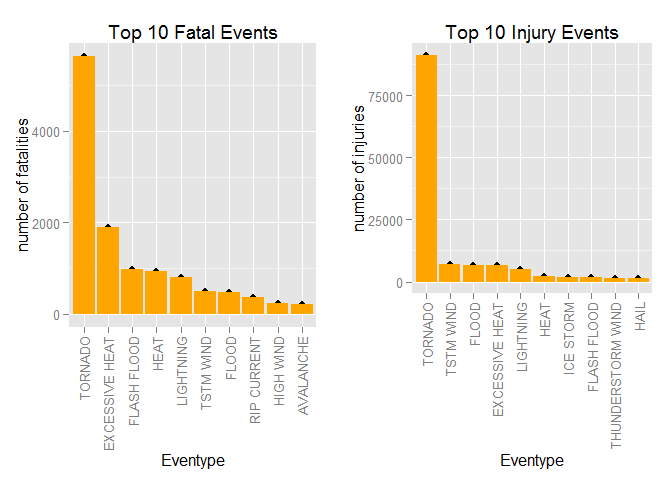
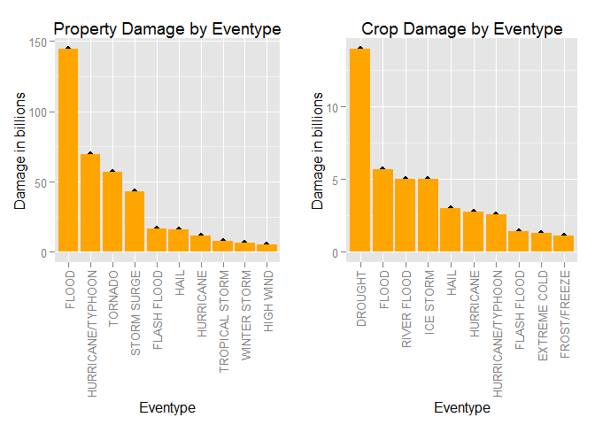

# PA2_template
john allen  
Monday, September 21, 2015  

#Title: Analysis of NOAA Storm database to determine Health and Economic Impacts of Weather Events 

#Synopsis
###This project explores the U.S. National Oceanic and Atmospheric Adminstrations (NOAA) storm database.  Severe weather events can result in injuries, fatalities, and property damage. This analysis will address which events are most harmful econmically and healthwise.

#Data Processing
####1. Load Libraries

```r
#install.packages("gridExtra")
library(gridExtra)
```

```
## Warning: package 'gridExtra' was built under R version 3.2.2
```

```r
library(Hmisc)   # impute function
```

```
## Warning: package 'Hmisc' was built under R version 3.2.2
```

```
## Loading required package: grid
## Loading required package: lattice
## Loading required package: survival
## Loading required package: Formula
```

```
## Warning: package 'Formula' was built under R version 3.2.2
```

```
## Loading required package: ggplot2
```

```
## Warning: package 'ggplot2' was built under R version 3.2.2
```

```
## 
## Attaching package: 'Hmisc'
## 
## The following objects are masked from 'package:base':
## 
##     format.pval, round.POSIXt, trunc.POSIXt, units
```

```r
library(ggplot2) #  use ggplot2 for plotting figures
library(grid)    # viewport to put plots side by side
library(plyr)
```

```
## Warning: package 'plyr' was built under R version 3.2.1
```

```
## 
## Attaching package: 'plyr'
## 
## The following objects are masked from 'package:Hmisc':
## 
##     is.discrete, summarize
```

####2. Read data
##### data obtained from:    
#####https://d396qusza40orc.cloudfront.net/repdata%2Fdata%2FStormData.csv.bz2


```r
storm_data <- read.csv("C:/Users/mom/Documents/RepData_PeerAssessment2/repdata-data-StormData.csv.bz2")
```
####3. Check number of rows

```r
dim(storm_data)
```

```
## [1] 902297     37
```
####4. Examine first few rows

```r
head(storm_data)
```

```
##   STATE__           BGN_DATE BGN_TIME TIME_ZONE COUNTY COUNTYNAME STATE
## 1       1  4/18/1950 0:00:00     0130       CST     97     MOBILE    AL
## 2       1  4/18/1950 0:00:00     0145       CST      3    BALDWIN    AL
## 3       1  2/20/1951 0:00:00     1600       CST     57    FAYETTE    AL
## 4       1   6/8/1951 0:00:00     0900       CST     89    MADISON    AL
## 5       1 11/15/1951 0:00:00     1500       CST     43    CULLMAN    AL
## 6       1 11/15/1951 0:00:00     2000       CST     77 LAUDERDALE    AL
##    EVTYPE BGN_RANGE BGN_AZI BGN_LOCATI END_DATE END_TIME COUNTY_END
## 1 TORNADO         0                                               0
## 2 TORNADO         0                                               0
## 3 TORNADO         0                                               0
## 4 TORNADO         0                                               0
## 5 TORNADO         0                                               0
## 6 TORNADO         0                                               0
##   COUNTYENDN END_RANGE END_AZI END_LOCATI LENGTH WIDTH F MAG FATALITIES
## 1         NA         0                      14.0   100 3   0          0
## 2         NA         0                       2.0   150 2   0          0
## 3         NA         0                       0.1   123 2   0          0
## 4         NA         0                       0.0   100 2   0          0
## 5         NA         0                       0.0   150 2   0          0
## 6         NA         0                       1.5   177 2   0          0
##   INJURIES PROPDMG PROPDMGEXP CROPDMG CROPDMGEXP WFO STATEOFFIC ZONENAMES
## 1       15    25.0          K       0                                    
## 2        0     2.5          K       0                                    
## 3        2    25.0          K       0                                    
## 4        2     2.5          K       0                                    
## 5        2     2.5          K       0                                    
## 6        6     2.5          K       0                                    
##   LATITUDE LONGITUDE LATITUDE_E LONGITUDE_ REMARKS REFNUM
## 1     3040      8812       3051       8806              1
## 2     3042      8755          0          0              2
## 3     3340      8742          0          0              3
## 4     3458      8626          0          0              4
## 5     3412      8642          0          0              5
## 6     3450      8748          0          0              6
```
####5. Extract the columns related to economic and health impact

```r
keep_col <- c("EVTYPE", "FATALITIES", "INJURIES", "PROPDMG", "PROPDMGEXP", "CROPDMG", 
              "CROPDMGEXP")
storm_data_1 <- storm_data[keep_col]
```
####6.  Identify property damage exponents

```r
unique(storm_data_1$PROPDMGEXP)
```

```
##  [1] K M   B m + 0 5 6 ? 4 2 3 h 7 H - 1 8
## Levels:  - ? + 0 1 2 3 4 5 6 7 8 B h H K m M
```
####7.  Identify crop damage exponents

```r
unique(storm_data_1$CROPDMGEXP)
```

```
## [1]   M K m B ? 0 k 2
## Levels:  ? 0 2 B k K m M
```
####8. Refactor PROPDMGEXP and obtain absolute value

```r
storm_data_1$PROPEXP[storm_data_1$PROPDMGEXP == "K"] <- 1000
storm_data_1$PROPEXP[storm_data_1$PROPDMGEXP == "M"] <- 1e+06
storm_data_1$PROPEXP[storm_data_1$PROPDMGEXP == ""]  <- 1
storm_data_1$PROPEXP[storm_data_1$PROPDMGEXP == "B"] <- 1e+09
storm_data_1$PROPEXP[storm_data_1$PROPDMGEXP == "m"] <- 1e+06
storm_data_1$PROPEXP[storm_data_1$PROPDMGEXP == "0"] <- 1
storm_data_1$PROPEXP[storm_data_1$PROPDMGEXP == "5"] <- 1e+05
storm_data_1$PROPEXP[storm_data_1$PROPDMGEXP == "6"] <- 1e+06
storm_data_1$PROPEXP[storm_data_1$PROPDMGEXP == "4"] <- 10000
storm_data_1$PROPEXP[storm_data_1$PROPDMGEXP == "2"] <- 100
storm_data_1$PROPEXP[storm_data_1$PROPDMGEXP == "3"] <- 1000
storm_data_1$PROPEXP[storm_data_1$PROPDMGEXP == "h"] <- 100
storm_data_1$PROPEXP[storm_data_1$PROPDMGEXP == "7"] <- 1e+07
storm_data_1$PROPEXP[storm_data_1$PROPDMGEXP == "H"] <- 100
storm_data_1$PROPEXP[storm_data_1$PROPDMGEXP == "1"] <- 10
storm_data_1$PROPEXP[storm_data_1$PROPDMGEXP == "8"] <- 1e+08
# give 0 to invalid exponent data
storm_data_1$PROPEXP[storm_data_1$PROPDMGEXP == "+"] <- 0
storm_data_1$PROPEXP[storm_data_1$PROPDMGEXP == "-"] <- 0
storm_data_1$PROPEXP[storm_data_1$PROPDMGEXP == "?"] <- 0
# compute the property damage value
storm_data_1$PROPDMGVAL <- storm_data_1$PROPDMG * storm_data_1$PROPEXP
```
####8. Refactor CROPDMGEXP and obtain absolute value

```r
storm_data_1$CROPEXP[storm_data_1$CROPDMGEXP == "M"] <- 1e+06
storm_data_1$CROPEXP[storm_data_1$CROPDMGEXP == "K"] <- 1000
storm_data_1$CROPEXP[storm_data_1$CROPDMGEXP == "m"] <- 1e+06
storm_data_1$CROPEXP[storm_data_1$CROPDMGEXP == "B"] <- 1e+09
storm_data_1$CROPEXP[storm_data_1$CROPDMGEXP == "0"] <- 1
storm_data_1$CROPEXP[storm_data_1$CROPDMGEXP == "k"] <- 1000
storm_data_1$CROPEXP[storm_data_1$CROPDMGEXP == "2"] <- 100
storm_data_1$CROPEXP[storm_data_1$CROPDMGEXP == ""] <- 1
# give 0 to invalid exponent data
storm_data_1$CROPEXP[storm_data_1$CROPDMGEXP == "?"] <- 0
# compute the crop damage value
storm_data_1$CROPDMGVAL <- storm_data_1$CROPDMG * storm_data_1$CROPEXP
#write csv file to play with graphing
write.csv(storm_data_1, file = "storm.csv",row.names=FALSE, na="")
```
####9. Sum damage data by event

```r
fatal <- aggregate(FATALITIES ~ EVTYPE, data = storm_data_1, FUN = sum)
injury <- aggregate(INJURIES ~ EVTYPE, data = storm_data_1, FUN = sum)
propdmg <- aggregate(PROPDMGVAL ~ EVTYPE, data = storm_data_1, FUN = sum)
cropdmg <- aggregate(CROPDMGVAL ~ EVTYPE, data = storm_data_1, FUN = sum)
```
#Results
###Across the United States, Which types of events are most harmful with respect to population health?

```r
# get top10 event with highest fatalities
fatal10 <- fatal[order(-fatal$FATALITIES), ][1:10, ]
f10 <- fatal10
# tell qplot is ordered so won't sort on eventype alpbetically
f10$EVTYPE <- factor(f10$EVTYPE, levels = f10$EVTYPE)
# plot
f <- qplot(EVTYPE,FATALITIES,data = f10, 
           main="Top 10 Fatal Events", 
           ylab="number of fatalities",xlab="Eventype") +
  geom_bar(stat = "identity",fill="orange") + 
  theme(axis.text.x = element_text(angle = 90, vjust = 0.5, hjust=1))
# get top10 event with highest injuries
injury10 <- injury[order(-injury$INJURIES), ][1:10, ]
i10 <- injury10
# tell qplot is ordered so won't sort on eventype alpbetically
i10$EVTYPE <- factor(i10$EVTYPE, levels = i10$EVTYPE)
# plot
i <- qplot(EVTYPE,INJURIES,data = i10, 
           main="Top 10 Injury Events", 
           ylab="number of injuries",xlab="Eventype") +
  geom_bar(stat = "identity",fill="orange") + 
  theme(axis.text.x = element_text(angle = 90, vjust = 0.5, hjust=1))
# arrange plots side by side
pushViewport(viewport(layout = grid.layout(1, 2)))
print(f, vp = viewport(layout.pos.row = 1, layout.pos.col = 1))
print(i,vp = viewport(layout.pos.row = 1, layout.pos.col = 2))
```

 
<br> 

###Tornados cause the most deaths and injuries.
##Across the United States, which types of events have the greatest economic consequences?

```r
# get top 10 events with highest property damage
propdmg10 <- propdmg[order(-propdmg$PROPDMGVAL), ][1:10, ]
# get top 10 events with highest crop damage
cropdmg10 <- cropdmg[order(-cropdmg$CROPDMGVAL), ][1:10, ]
# writing csv files so I can play with plots separatly without loading large data
write.csv(propdmg10, file = "prop.csv",row.names=FALSE, na="")
write.csv(cropdmg10, file = "crop.csv",row.names=FALSE, na="")
prop <- read.csv("C:/Users/mom/Documents/RepData_PeerAssessment2/prop.csv")
y <- prop
y$PROPDMGVAL <- y$PROPDMGVAL/(10^9)  
y
```

```
##               EVTYPE PROPDMGVAL
## 1              FLOOD 144.657710
## 2  HURRICANE/TYPHOON  69.305840
## 3            TORNADO  56.947381
## 4        STORM SURGE  43.323536
## 5        FLASH FLOOD  16.822674
## 6               HAIL  15.735268
## 7          HURRICANE  11.868319
## 8     TROPICAL STORM   7.703891
## 9       WINTER STORM   6.688497
## 10         HIGH WIND   5.270046
```

```r
y$EVTYPE <- factor(y$EVTYPE, levels = y$EVTYPE)
q <- qplot(EVTYPE,PROPDMGVAL,data = y, 
      main="Property Damage by Eventype", 
      ylab="Damage in billions",xlab="Eventype") +
      geom_bar(stat = "identity",fill="orange") + 
  theme(axis.text.x = element_text(angle = 90, vjust = 0.5, hjust=1))
crop <- read.csv("C:/Users/mom/Documents/RepData_PeerAssessment2/crop.csv")
z <- crop
# divide so numbers readble
z$CROPDMGVAL <- z$CROPDMGVAL/(10^9)  
# tell ggplot fator is ordered
z$EVTYPE <- factor(z$EVTYPE, levels = z$EVTYPE)
q1 <- qplot(EVTYPE,CROPDMGVAL,data= z, 
           main="Crop Damage by Eventype", 
           ylab="Damage in billions",xlab="Eventype") +
  geom_bar(stat = "identity",fill="orange") + 
  theme(axis.text.x = element_text(angle = 90, vjust = 0.5, hjust=1))
pushViewport(viewport(layout = grid.layout(1, 2)))
print(q, vp = viewport(layout.pos.row = 1, layout.pos.col = 1))
print(q1,vp = viewport(layout.pos.row = 1, layout.pos.col = 2))
```

 

| -----------------------------------------------------------

###Flood, hurricane + typhoon, tornados have caused the greatest damage to properties. Drought and flood have caused for the greatest damage to crops.
